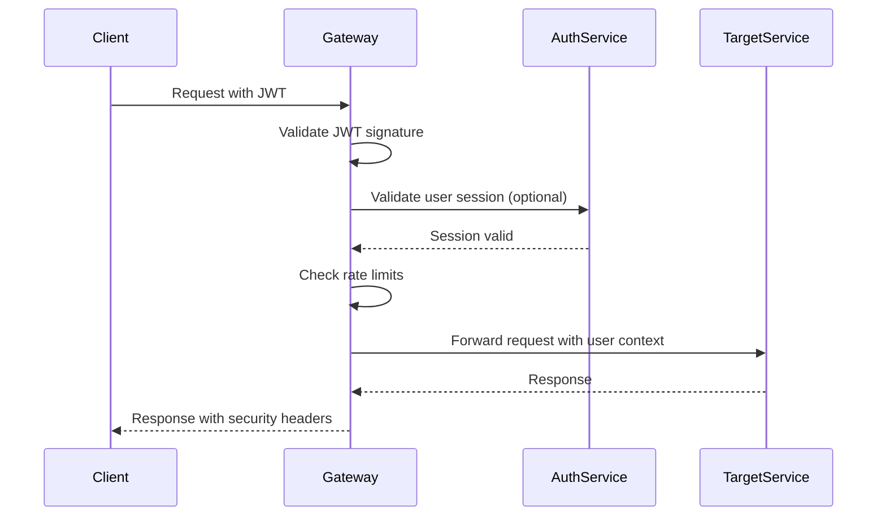

# Serenity API Gateway Reference

Complete API reference for the Serenity API Gateway, including all routes, authentication methods, rate limiting, and response formats.

## 📋 Table of Contents

- [Base URLs](#base-urls)
- [Authentication](#authentication)
- [Rate Limiting](#rate-limiting)
- [Service Routes](#service-routes)
- [Management APIs](#management-apis)
- [Error Handling](#error-handling)
- [Response Formats](#response-formats)
- [WebSocket Support](#websocket-support)
- [Security Headers](#security-headers)
- [Monitoring Endpoints](#monitoring-endpoints)
- [SDK Examples](#sdk-examples)

## 🌐 Base URLs

### Development
```
HTTP:  http://localhost:8000
HTTPS: https://localhost:8443
Admin: http://localhost:8001
```

### Staging
```
HTTP:  http://staging-api.serenity.app
HTTPS: https://staging-api.serenity.app
Admin: http://staging-admin.serenity.app:8001
```

### Production
```
HTTP:  http://api.serenity.app
HTTPS: https://api.serenity.app
Admin: http://admin.serenity.app:8001 (VPN only)
```

## 🔐 Authentication

### JWT Authentication

All protected endpoints require JWT authentication in the Authorization header:

```http
Authorization: Bearer <jwt-token>
```

#### JWT Token Structure

```json
{
  "header": {
    "alg": "HS256",
    "typ": "JWT"
  },
  "payload": {
    "sub": "user-uuid",
    "email": "user@example.com",
    "role": "patient|provider|supporter|admin",
    "session_id": "session-uuid",
    "iat": 1640995200,
    "exp": 1640995800,
    "iss": "serenity-auth-service",
    "aud": ["serenity-app"]
  }
}
```

#### Session Management

- **Session Timeout**: 15 minutes (900 seconds) for HIPAA compliance
- **Refresh Required**: Tokens must be refreshed before expiry
- **Auto-logout**: Users are automatically logged out after inactivity

### API Key Authentication

Service-to-service communication uses API keys:

```http
X-API-Key: serenity-internal-api-key
```

### Authentication Flow



## 🚦 Rate Limiting

### Rate Limit Tiers

| User Role | Per Minute | Per Hour | Per Day |
|-----------|------------|----------|---------|
| Admin | 1,000 | 10,000 | 100,000 |
| Provider | 500 | 5,000 | 50,000 |
| Supporter | 200 | 2,000 | 20,000 |
| Patient | 100 | 1,000 | 10,000 |
| Anonymous | 20 | 200 | 2,000 |

### Crisis Service Exception

Crisis and emergency endpoints receive 10x rate limit multiplier:

- Crisis endpoints: `/api/crisis/*`, `/api/emergency/*`
- Emergency multiplier applies to all user roles
- No rate limiting for authenticated crisis alerts

### Rate Limit Headers

Every response includes rate limiting information:

```http
X-RateLimit-Limit-Minute: 100
X-RateLimit-Remaining-Minute: 87
X-RateLimit-Limit-Hour: 1000
X-RateLimit-Remaining-Hour: 913
X-RateLimit-Limit-Day: 10000
X-RateLimit-Remaining-Day: 9913
X-RateLimit-Policy: redis
X-RateLimit-Identifier: user
```

### Rate Limit Exceeded Response

```http
HTTP/1.1 429 Too Many Requests
Content-Type: application/json
Retry-After: 60

{
  "error": "Rate limit exceeded",
  "message": "Too many requests per minute",
  "retry_after": 60,
  "limits": {
    "minute": 100,
    "hour": 1000,
    "day": 10000
  }
}
```

## 🔄 Service Routes

### Authentication Service
**Base Path**: `/api/auth`, `/api/v1/auth`  
**Target**: `http://host.docker.internal:3000`  
**Authentication**: Public for login/register, Protected for profile

#### Endpoints

| Method | Path | Description | Auth Required |
|--------|------|-------------|---------------|
| POST | `/api/auth/login` | User login | No |
| POST | `/api/auth/register` | User registration | No |
| POST | `/api/auth/logout` | User logout | Yes |
| GET | `/api/auth/profile` | Get user profile | Yes |
| PUT | `/api/auth/profile` | Update user profile | Yes |
| POST | `/api/auth/refresh` | Refresh JWT token | Yes |
| POST | `/api/auth/password/reset` | Request password reset | No |
| POST | `/api/auth/password/confirm` | Confirm password reset | No |

#### Login Example

```http
POST /api/auth/login
Content-Type: application/json

{
  "email": "patient@example.com",
  "password": "SecurePassword123!",
  "remember_me": true
}
```

```http
HTTP/1.1 200 OK
Content-Type: application/json

{
  "access_token": "eyJhbGciOiJIUzI1NiIsInR5cCI6IkpXVCJ9...",
  "refresh_token": "eyJhbGciOiJIUzI1NiIsInR5cCI6IkpXVCJ9...",
  "token_type": "Bearer",
  "expires_in": 900,
  "user": {
    "id": "user-uuid",
    "email": "patient@example.com",
    "role": "patient",
    "profile": {
      "first_name": "John",
      "last_name": "Doe"
    }
  }
}
```

### Notification Service
**Base Path**: `/api/notifications`, `/api/v1/notifications`  
**Target**: `http://host.docker.internal:8000`  
**Authentication**: Required

#### Endpoints

| Method | Path | Description |
|--------|------|-------------|
| GET | `/api/notifications` | List notifications |
| POST | `/api/notifications` | Create notification |
| GET | `/api/notifications/{id}` | Get notification |
| PUT | `/api/notifications/{id}` | Update notification |
| DELETE | `/api/notifications/{id}` | Delete notification |
| POST | `/api/notifications/send` | Send notification |
| GET | `/api/notifications/preferences` | Get user preferences |
| PUT | `/api/notifications/preferences` | Update preferences |

#### Send Notification Example

```http
POST /api/notifications/send
Authorization: Bearer <jwt-token>
Content-Type: application/json

{
  "type": "crisis_alert",
  "recipient_ids": ["user-uuid-1", "user-uuid-2"],
  "title": "Crisis Alert",
  "message": "Patient needs immediate assistance",
  "priority": "critical",
  "channels": ["push", "sms", "email"],
  "data": {
    "patient_id": "patient-uuid",
    "location": "Emergency Room",
    "timestamp": "2024-01-15T10:30:00Z"
  }
}
```

### Crisis Service
**Base Path**: `/api/crisis`, `/api/v1/crisis`, `/api/emergency`  
**Target**: `http://host.docker.internal:8080`  
**Authentication**: Required  
**Special**: Enhanced rate limits, high priority routing

#### Endpoints

| Method | Path | Description |
|--------|------|-------------|
| POST | `/api/crisis/alert` | Create crisis alert |
| GET | `/api/crisis/alerts` | List crisis alerts |
| GET | `/api/crisis/alerts/{id}` | Get crisis alert |
| PUT | `/api/crisis/alerts/{id}` | Update crisis alert |
| POST | `/api/crisis/resources` | Get crisis resources |
| GET | `/api/crisis/contacts` | Get emergency contacts |
| POST | `/api/crisis/contacts` | Add emergency contact |
| GET | `/api/crisis/history` | Get crisis history |

#### Crisis Alert Example

```http
POST /api/crisis/alert
Authorization: Bearer <jwt-token>
Content-Type: application/json

{
  "type": "mental_health_emergency",
  "severity": "high",
  "description": "Experiencing severe anxiety and panic",
  "location": {
    "latitude": 40.7128,
    "longitude": -74.0060,
    "address": "123 Main St, New York, NY"
  },
  "contacts_to_notify": ["emergency-contact-uuid"],
  "immediate_assistance": true,
  "metadata": {
    "symptoms": ["anxiety", "panic", "breathing_difficulty"],
    "previous_episodes": 2,
    "medications": ["sertraline"]
  }
}
```

```http
HTTP/1.1 201 Created
Content-Type: application/json

{
  "id": "crisis-alert-uuid",
  "status": "active",
  "created_at": "2024-01-15T10:30:00Z",
  "estimated_response_time": "5-10 minutes",
  "assigned_responders": ["responder-uuid-1"],
  "emergency_number": "+1-988-CRISIS",
  "resources": [
    {
      "type": "hotline",
      "name": "National Crisis Lifeline",
      "phone": "988",
      "available": "24/7"
    }
  ]
}
```

### WebSocket Service
**Base Path**: `/ws`, `/api/ws`  
**Target**: `ws://host.docker.internal:8001`  
**Authentication**: JWT via query parameter or header

#### Connection

```javascript
// Connect to WebSocket
const ws = new WebSocket('ws://localhost:8000/ws?jwt=<jwt-token>');

// Or via header (if supported by client)
const ws = new WebSocket('ws://localhost:8000/ws', {
  headers: {
    'Authorization': 'Bearer <jwt-token>'
  }
});
```

#### Message Types

```javascript
// Crisis alert
{
  "type": "crisis_alert",
  "data": {
    "alert_id": "crisis-uuid",
    "patient_id": "patient-uuid",
    "severity": "high",
    "message": "Crisis alert activated"
  }
}

// Real-time notification
{
  "type": "notification",
  "data": {
    "notification_id": "notif-uuid",
    "title": "New message",
    "message": "You have a new message from your provider"
  }
}

// System status
{
  "type": "system_status",
  "data": {
    "status": "healthy",
    "services": ["auth", "crisis", "notification"]
  }
}
```

### Frontend Application
**Base Path**: `/`, `/app/*`, `/dashboard/*`  
**Target**: `http://host.docker.internal:8080`  
**Authentication**: Not required for static assets, Required for app routes

Static assets and React application are served directly. Authentication is handled client-side with JWT tokens.

## 🛠️ Management APIs

### Health Check Aggregator
**Base Path**: `/health`  
**Target**: Health Checker Service  
**Authentication**: Not required

#### Endpoints

| Method | Path | Description |
|--------|------|-------------|
| GET | `/health` | Overall system health |
| GET | `/health/{service}` | Specific service health |
| GET | `/status` | Cached health status |
| GET | `/metrics` | Prometheus metrics |

#### Health Response Format

```json
{
  "timestamp": "2024-01-15T10:30:00Z",
  "overall": {
    "status": "healthy",
    "healthy": true,
    "summary": {
      "total": 6,
      "healthy": 5,
      "unhealthy": 1,
      "critical": 3,
      "criticalHealthy": 2
    }
  },
  "services": {
    "auth-service": {
      "healthy": true,
      "responseTime": 45,
      "status": 200,
      "critical": true,
      "url": "http://host.docker.internal:3000",
      "endpoint": "/health",
      "timestamp": "2024-01-15T10:30:00Z"
    },
    "crisis-service": {
      "healthy": false,
      "responseTime": 5000,
      "error": "Connection timeout",
      "critical": true,
      "url": "http://host.docker.internal:8080",
      "endpoint": "/health",
      "timestamp": "2024-01-15T10:30:00Z"
    }
  },
  "version": "1.0.0",
  "uptime": 86400
}
```

### Kong Admin API
**Base Path**: `/admin` (proxied to Kong Admin)  
**Target**: Kong Admin API  
**Authentication**: Admin API key required

#### Key Endpoints

| Method | Path | Description |
|--------|------|-------------|
| GET | `/admin/status` | Kong status |
| GET | `/admin/services` | List services |
| GET | `/admin/routes` | List routes |
| GET | `/admin/plugins` | List plugins |
| GET | `/admin/consumers` | List consumers |

### Circuit Breaker Status
**Base Path**: `/circuit-status`  
**Target**: Circuit Breaker Service  
**Authentication**: Not required

```json
{
  "auth_service": "closed",
  "notification_service": "closed",
  "crisis_service": "half-open",
  "frontend_app": "closed",
  "timestamp": 1640995200
}
```

## ❌ Error Handling

### Standard Error Response Format

```json
{
  "error": "error_code",
  "message": "Human readable error message",
  "details": "Additional error details",
  "timestamp": "2024-01-15T10:30:00Z",
  "request_id": "req-uuid-1234",
  "status": 400
}
```

### HTTP Status Codes

| Code | Name | Description |
|------|------|-------------|
| 200 | OK | Request successful |
| 201 | Created | Resource created |
| 400 | Bad Request | Invalid request format |
| 401 | Unauthorized | Missing or invalid authentication |
| 403 | Forbidden | Access denied |
| 404 | Not Found | Resource not found |
| 429 | Too Many Requests | Rate limit exceeded |
| 500 | Internal Server Error | Server error |
| 502 | Bad Gateway | Upstream service error |
| 503 | Service Unavailable | Service temporarily unavailable |

### Error Examples

#### Authentication Error

```http
HTTP/1.1 401 Unauthorized
Content-Type: application/json

{
  "error": "invalid_token",
  "message": "JWT token has expired",
  "details": "Token expired at 2024-01-15T10:25:00Z",
  "timestamp": "2024-01-15T10:30:00Z",
  "request_id": "req-uuid-1234"
}
```

#### Rate Limit Error

```http
HTTP/1.1 429 Too Many Requests
Content-Type: application/json
Retry-After: 60

{
  "error": "rate_limit_exceeded",
  "message": "Too many requests per minute",
  "retry_after": 60,
  "limits": {
    "minute": 100,
    "hour": 1000,
    "day": 10000
  },
  "request_id": "req-uuid-1234"
}
```

#### Service Unavailable

```http
HTTP/1.1 503 Service Unavailable
Content-Type: application/json

{
  "error": "service_unavailable",
  "message": "Crisis service is temporarily unavailable",
  "details": "Circuit breaker is open for crisis-service",
  "fallback_url": "/crisis-fallback",
  "estimated_recovery": "2024-01-15T10:35:00Z",
  "request_id": "req-uuid-1234"
}
```

## 📊 Response Formats

### Pagination

Large datasets are paginated using cursor-based pagination:

```json
{
  "data": [...],
  "pagination": {
    "has_more": true,
    "next_cursor": "cursor-string",
    "prev_cursor": "cursor-string",
    "total_count": 1250
  }
}
```

#### Pagination Parameters

| Parameter | Type | Description | Default |
|-----------|------|-------------|---------|
| `cursor` | string | Pagination cursor | - |
| `limit` | integer | Items per page (max 100) | 20 |
| `order` | string | Sort order (asc/desc) | desc |
| `sort_by` | string | Sort field | created_at |

### Filtering

```http
GET /api/notifications?status=unread&type=crisis_alert&created_after=2024-01-01T00:00:00Z
```

### Sorting

```http
GET /api/crisis/alerts?sort_by=severity&order=desc
```

## 🔌 WebSocket Support

### Connection Management

```javascript
class SerenityWebSocket {
  constructor(token) {
    this.token = token;
    this.ws = null;
    this.reconnectAttempts = 0;
    this.maxReconnectAttempts = 5;
  }

  connect() {
    this.ws = new WebSocket(`wss://api.serenity.app/ws?jwt=${this.token}`);
    
    this.ws.onopen = () => {
      console.log('WebSocket connected');
      this.reconnectAttempts = 0;
      this.heartbeat();
    };

    this.ws.onmessage = (event) => {
      const message = JSON.parse(event.data);
      this.handleMessage(message);
    };

    this.ws.onclose = () => {
      console.log('WebSocket disconnected');
      this.reconnect();
    };

    this.ws.onerror = (error) => {
      console.error('WebSocket error:', error);
    };
  }

  handleMessage(message) {
    switch (message.type) {
      case 'crisis_alert':
        this.onCrisisAlert(message.data);
        break;
      case 'notification':
        this.onNotification(message.data);
        break;
      case 'pong':
        // Heartbeat response
        break;
    }
  }

  heartbeat() {
    setInterval(() => {
      if (this.ws.readyState === WebSocket.OPEN) {
        this.ws.send(JSON.stringify({ type: 'ping' }));
      }
    }, 30000);
  }

  reconnect() {
    if (this.reconnectAttempts < this.maxReconnectAttempts) {
      this.reconnectAttempts++;
      setTimeout(() => this.connect(), 5000 * this.reconnectAttempts);
    }
  }
}
```

### Message Protocol

#### Client to Server

```json
{
  "type": "subscribe",
  "data": {
    "channels": ["crisis_alerts", "notifications"],
    "user_id": "user-uuid"
  }
}
```

#### Server to Client

```json
{
  "type": "crisis_alert",
  "data": {
    "alert_id": "alert-uuid",
    "patient_id": "patient-uuid",
    "severity": "high",
    "location": {...},
    "timestamp": "2024-01-15T10:30:00Z"
  }
}
```

## 🛡️ Security Headers

All responses include comprehensive security headers:

```http
X-Frame-Options: DENY
X-Content-Type-Options: nosniff
X-XSS-Protection: 1; mode=block
Referrer-Policy: strict-origin-when-cross-origin
Strict-Transport-Security: max-age=31536000; includeSubDomains; preload
Content-Security-Policy: default-src 'self'; script-src 'self' 'unsafe-inline' 'unsafe-eval'; style-src 'self' 'unsafe-inline'; img-src 'self' data: https:; connect-src 'self' wss: https:; font-src 'self' data:; object-src 'none'; media-src 'self'; child-src 'none';
Permissions-Policy: geolocation=(), microphone=(), camera=(), payment=(), usb=()
Cross-Origin-Embedder-Policy: require-corp
Cross-Origin-Opener-Policy: same-origin
Cross-Origin-Resource-Policy: cross-origin
X-Data-Classification: PHI
X-Audit-Required: true
X-Encryption-Required: true
X-Request-ID: req-uuid-1234
X-Gateway: Kong-Serenity
X-API-Version: v1.0
```

## 📈 Monitoring Endpoints

### Prometheus Metrics

```http
GET /metrics
Content-Type: text/plain

# Kong request metrics
kong_http_requests_total{service="auth-service",method="POST",status="200"} 1234
kong_http_request_duration_seconds_bucket{service="auth-service",le="0.1"} 100
kong_http_request_duration_seconds_bucket{service="auth-service",le="0.5"} 890

# Rate limiting metrics
kong_rate_limiting_exceeded_total{service="crisis-service"} 5

# Circuit breaker metrics
circuit_breaker_state{service="auth-service",state="closed"} 1
circuit_breaker_failures_total{service="crisis-service"} 3
```

### Custom Metrics

```http
# HIPAA compliance metrics
hipaa_audit_logs_total{service="auth-service",user_role="patient"} 456
hipaa_phi_access_total{service="crisis-service",data_type="medical_record"} 78

# Performance metrics
serenity_response_time_seconds{service="crisis-service",percentile="95"} 0.234
serenity_error_rate{service="notification-service"} 0.001
```

## 💻 SDK Examples

### JavaScript/TypeScript

```typescript
class SerenityAPIClient {
  private baseURL: string;
  private token: string;

  constructor(baseURL: string, token?: string) {
    this.baseURL = baseURL;
    this.token = token;
  }

  async request(method: string, path: string, data?: any) {
    const headers: HeadersInit = {
      'Content-Type': 'application/json',
    };

    if (this.token) {
      headers['Authorization'] = `Bearer ${this.token}`;
    }

    const response = await fetch(`${this.baseURL}${path}`, {
      method,
      headers,
      body: data ? JSON.stringify(data) : undefined,
    });

    if (!response.ok) {
      const error = await response.json();
      throw new Error(`API Error: ${error.message}`);
    }

    return response.json();
  }

  // Authentication
  async login(email: string, password: string) {
    return this.request('POST', '/api/auth/login', { email, password });
  }

  async getProfile() {
    return this.request('GET', '/api/auth/profile');
  }

  // Crisis Management
  async createCrisisAlert(alert: CrisisAlert) {
    return this.request('POST', '/api/crisis/alert', alert);
  }

  async getCrisisAlerts() {
    return this.request('GET', '/api/crisis/alerts');
  }

  // Notifications
  async getNotifications() {
    return this.request('GET', '/api/notifications');
  }

  async sendNotification(notification: Notification) {
    return this.request('POST', '/api/notifications/send', notification);
  }
}

// Usage
const client = new SerenityAPIClient('https://api.serenity.app');

// Login and set token
const auth = await client.login('user@example.com', 'password');
client.token = auth.access_token;

// Create crisis alert
const alert = await client.createCrisisAlert({
  type: 'mental_health_emergency',
  severity: 'high',
  description: 'Need immediate help'
});
```

### Python

```python
import requests
import json
from typing import Dict, Optional, Any

class SerenityAPIClient:
    def __init__(self, base_url: str, token: Optional[str] = None):
        self.base_url = base_url
        self.token = token
        self.session = requests.Session()
        
    def _make_request(self, method: str, path: str, data: Optional[Dict] = None) -> Dict[str, Any]:
        headers = {'Content-Type': 'application/json'}
        
        if self.token:
            headers['Authorization'] = f'Bearer {self.token}'
            
        url = f"{self.base_url}{path}"
        
        response = self.session.request(
            method=method,
            url=url,
            headers=headers,
            json=data if data else None
        )
        
        response.raise_for_status()
        return response.json()
    
    def login(self, email: str, password: str) -> Dict[str, Any]:
        return self._make_request('POST', '/api/auth/login', {
            'email': email,
            'password': password
        })
    
    def get_profile(self) -> Dict[str, Any]:
        return self._make_request('GET', '/api/auth/profile')
    
    def create_crisis_alert(self, alert: Dict[str, Any]) -> Dict[str, Any]:
        return self._make_request('POST', '/api/crisis/alert', alert)
    
    def get_crisis_alerts(self) -> Dict[str, Any]:
        return self._make_request('GET', '/api/crisis/alerts')

# Usage
client = SerenityAPIClient('https://api.serenity.app')

# Login
auth = client.login('user@example.com', 'password')
client.token = auth['access_token']

# Create crisis alert
alert = client.create_crisis_alert({
    'type': 'mental_health_emergency',
    'severity': 'high',
    'description': 'Need immediate help'
})
```

### cURL Examples

```bash
#!/bin/bash

# Set base URL and get token
BASE_URL="https://api.serenity.app"
TOKEN=""

# Login
login_response=$(curl -s -X POST "$BASE_URL/api/auth/login" \
  -H "Content-Type: application/json" \
  -d '{
    "email": "user@example.com",
    "password": "password"
  }')

TOKEN=$(echo $login_response | jq -r '.access_token')

# Get profile
curl -X GET "$BASE_URL/api/auth/profile" \
  -H "Authorization: Bearer $TOKEN" \
  -H "Content-Type: application/json"

# Create crisis alert
curl -X POST "$BASE_URL/api/crisis/alert" \
  -H "Authorization: Bearer $TOKEN" \
  -H "Content-Type: application/json" \
  -d '{
    "type": "mental_health_emergency",
    "severity": "high",
    "description": "Need immediate help",
    "location": {
      "latitude": 40.7128,
      "longitude": -74.0060
    }
  }'

# Get notifications with pagination
curl -X GET "$BASE_URL/api/notifications?limit=10&cursor=abc123" \
  -H "Authorization: Bearer $TOKEN"

# Send notification
curl -X POST "$BASE_URL/api/notifications/send" \
  -H "Authorization: Bearer $TOKEN" \
  -H "Content-Type: application/json" \
  -d '{
    "type": "reminder",
    "recipient_ids": ["user-uuid"],
    "title": "Medication Reminder",
    "message": "Time to take your medication"
  }'
```

---

**For detailed implementation examples and advanced use cases, please refer to the SDK documentation or contact the development team.**

**Support**: api-support@serenity.app  
**Documentation**: https://docs.serenity.app  
**Status Page**: https://status.serenity.app