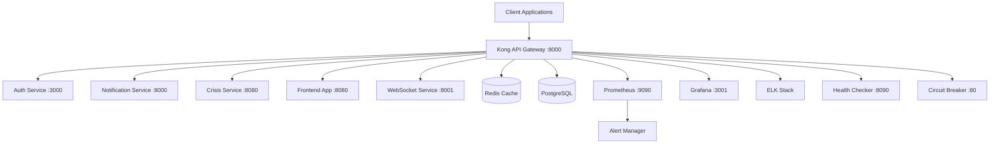

# Serenity API Gateway

A comprehensive HIPAA-compliant API Gateway built with Kong, designed for the Serenity mental health and substance abuse recovery platform. This gateway provides secure, scalable, and monitored access to all microservices with advanced features like authentication, rate limiting, circuit breakers, and comprehensive logging.

## 🏗️ Architecture Overview



## 🚀 Quick Start

### Prerequisites

- Docker Desktop 4.0+
- Docker Compose 2.0+
- 8GB RAM minimum
- Windows 10/11 or macOS/Linux

### Development Setup

1. **Clone and navigate to the API Gateway directory:**
   ```bash
   cd C:/dev/serenity/api-gateway
   ```

2. **Start all services:**
   
   **Windows:**
   ```cmd
   scripts\start-gateway.bat
   ```
   
   **Linux/macOS:**
   ```bash
   chmod +x scripts/start-gateway.sh
   ./scripts/start-gateway.sh
   ```

3. **Access the services:**
   - Kong Proxy: http://localhost:8000
   - Kong Admin: http://localhost:8001
   - Kong Manager: http://localhost:8002
   - Konga UI: http://localhost:1337
   - Grafana: http://localhost:3001 (admin/admin)
   - Prometheus: http://localhost:9090
   - Kibana: http://localhost:5601
   - Health Checker: http://localhost:8090/health

### Production Setup

1. **Run the production setup script:**
   ```bash
   ./scripts/production-setup.sh
   ```

2. **Start with production configuration:**
   ```bash
   docker-compose -f docker-compose.yml -f docker-compose.prod.yml --env-file .env.production up -d
   ```

## 📊 Service Routes

### API Routes

| Route | Target Service | Description |
|-------|---------------|-------------|
| `/api/auth/*` | Auth Service (port 3000) | Authentication & authorization |
| `/api/notifications/*` | Notification Service (port 8000) | Push notifications & messaging |
| `/api/crisis/*` | Crisis Service (port 8080) | Emergency response & crisis management |
| `/ws/*` | WebSocket Service (port 8001) | Real-time features & notifications |
| `/*` | Frontend App (port 8080) | React application & static assets |

### Management Routes

| Route | Service | Description |
|-------|---------|-------------|
| `/health` | Health Checker | Aggregated health status |
| `/metrics` | Prometheus | System metrics |
| `/circuit-status` | Circuit Breaker | Circuit breaker status |
| `/admin` | Kong Admin UI | API Gateway management |

## 🔒 Security Features

### Authentication & Authorization

- **JWT Authentication**: Extended JWT plugin with HIPAA compliance
  - 15-minute session timeout for PHI access
  - Supabase integration for user validation
  - Comprehensive audit logging
  - Automatic session expiry

### Rate Limiting

- **Role-based limits**:
  - Admin: 1000/min, 10k/hour, 100k/day
  - Provider: 500/min, 5k/hour, 50k/day
  - Patient: 100/min, 1k/hour, 10k/day
  - Supporter: 200/min, 2k/hour, 20k/day

- **Emergency bypass**: 10x rate limit multiplier for crisis endpoints
- **Redis-backed**: Distributed rate limiting across instances
- **API Key management**: Service-to-service authentication

### Security Headers

- **HIPAA-compliant headers**:
  - Content Security Policy (CSP)
  - Strict Transport Security (HSTS)
  - X-Frame-Options: DENY
  - X-Content-Type-Options: nosniff
  - Cross-Origin policies

### CORS Configuration

- **Allowed origins**: Configurable whitelist
- **Credentials support**: Secure cookie handling
- **Preflight handling**: Automatic OPTIONS responses

## 🏥 HIPAA Compliance

### Audit Logging

- **Comprehensive logging**: All API calls with user context
- **PHI access tracking**: Special handling for sensitive endpoints
- **Elasticsearch storage**: Searchable audit trail
- **Retention policy**: 7-year data retention

### Data Protection

- **Encryption in transit**: TLS 1.3 enforced
- **Encryption at rest**: Database and file encryption
- **Session management**: Automatic timeout and secure sessions
- **Access controls**: Role-based permissions

### Monitoring & Alerting

- **Real-time monitoring**: Health checks every 30 seconds
- **Security alerts**: Unauthorized access attempts
- **Compliance dashboards**: HIPAA-specific metrics
- **Incident response**: Automated alert workflows

## 🔄 Circuit Breaker Pattern

### Configuration

- **Failure threshold**: 5 failures trigger open state
- **Recovery timeout**: 60 seconds before half-open
- **Half-open requests**: 3 test requests for recovery

### Fallback Pages

- **Maintenance page**: General service unavailability
- **Crisis fallback**: Emergency resources when crisis service is down
- **Service-specific**: Tailored messages per service

## 📈 Monitoring & Observability

### Metrics Collection

- **Kong metrics**: Request rate, latency, error rate
- **System metrics**: CPU, memory, disk usage
- **Application metrics**: Business KPIs
- **Security metrics**: Authentication failures, rate limiting

### Dashboards

- **System overview**: High-level health status
- **Performance metrics**: Response times and throughput
- **Security dashboard**: Attack patterns and anomalies
- **Crisis service**: Dedicated monitoring for critical service

### Alerting Rules

- **Critical alerts**: Service down, database failure
- **Performance alerts**: High latency, error rate
- **Security alerts**: Unauthorized access, rate limiting
- **HIPAA alerts**: Audit failures, PHI exposure

## 📝 Logging Strategy

### Log Types

- **Access logs**: All HTTP requests/responses
- **Application logs**: Service-specific logging
- **Audit logs**: HIPAA-required audit trail
- **Security logs**: Authentication and authorization events

### Log Processing

- **Structured logging**: JSON format for searchability
- **Log enrichment**: GeoIP, user context, security classification
- **Real-time processing**: Logstash pipeline
- **Long-term storage**: Elasticsearch with retention policies

## 🎯 Health Monitoring

### Health Check Aggregation

```javascript
// Health check endpoint response
{
  "timestamp": "2024-01-15T10:30:00Z",
  "overall": {
    "status": "healthy",
    "healthy": true,
    "summary": {
      "total": 6,
      "healthy": 5,
      "unhealthy": 1,
      "critical": 3,
      "criticalHealthy": 3
    }
  },
  "services": {
    "auth-service": {
      "healthy": true,
      "responseTime": 45,
      "critical": true
    },
    "crisis-service": {
      "healthy": true,
      "responseTime": 23,
      "critical": true
    }
  }
}
```

### Service Discovery

- **Automatic registration**: Services register on startup
- **Health monitoring**: Continuous health checking
- **Load balancing**: Automatic routing to healthy instances
- **Failover**: Automatic traffic routing during failures

## 🔧 Configuration Management

### Environment Variables

| Variable | Description | Default |
|----------|-------------|---------|
| `KONG_PG_PASSWORD` | PostgreSQL password | Generated |
| `KONG_REDIS_PASSWORD` | Redis password | Generated |
| `JWT_SECRET_KEY` | JWT signing key | Generated |
| `ALERT_WEBHOOK_TOKEN` | Webhook auth token | Generated |

### Kong Configuration

Located in `config/kong.yml`:

- **Services**: Microservice definitions
- **Routes**: URL routing rules
- **Plugins**: Security and monitoring plugins
- **Consumers**: API consumers and keys

## 🚨 Troubleshooting

### Common Issues

#### Services Won't Start

1. **Check Docker**: Ensure Docker is running
2. **Port conflicts**: Check if ports 8000-8002 are available
3. **Memory**: Ensure 8GB+ RAM available
4. **Permissions**: Check file permissions on scripts

#### Kong Returns 502 Error

1. **Service connectivity**: Check if backend services are running
2. **Network**: Verify Docker network connectivity
3. **Configuration**: Validate Kong configuration syntax
4. **Logs**: Check Kong logs for specific errors

#### Health Checks Failing

1. **Service status**: Check individual service health endpoints
2. **Network**: Verify internal Docker networking
3. **Timeouts**: Increase health check timeouts
4. **Resources**: Check CPU/memory usage

### Log Analysis

```bash
# View Kong logs
docker-compose logs kong

# View all service logs
docker-compose logs -f

# Check specific service
docker-compose logs -f auth-service

# View health checker logs
docker-compose logs health-checker
```

### Performance Tuning

```bash
# Monitor resource usage
docker stats

# Check Kong configuration
curl http://localhost:8001/status

# View prometheus metrics
curl http://localhost:9090/metrics
```

## 📚 API Documentation

### Authentication

All protected endpoints require JWT authentication:

```bash
curl -H "Authorization: Bearer <jwt-token>" \
     http://localhost:8000/api/notifications
```

### Rate Limiting Headers

Responses include rate limiting information:

```http
X-RateLimit-Limit-Minute: 100
X-RateLimit-Remaining-Minute: 85
X-RateLimit-Limit-Hour: 1000
X-RateLimit-Remaining-Hour: 850
```

### Error Responses

```json
{
  "error": "Rate limit exceeded",
  "message": "Too many requests per minute", 
  "retry_after": 60
}
```

## 🚀 Deployment

### Development

```bash
./scripts/start-gateway.sh
```

### Production

```bash
# Setup production environment
./scripts/production-setup.sh

# Start with production config
docker-compose -f docker-compose.yml -f docker-compose.prod.yml --env-file .env.production up -d
```

### Scaling

```yaml
# Scale Kong instances
docker-compose up -d --scale kong=3

# Scale health checker
docker-compose up -d --scale health-checker=2
```

## 🔐 Security Best Practices

### Production Checklist

- [ ] Replace self-signed certificates with CA-signed certificates
- [ ] Change all default passwords
- [ ] Configure firewall rules
- [ ] Set up VPN access for admin interfaces
- [ ] Enable automated backups
- [ ] Configure SMTP for alerts
- [ ] Review and customize CORS settings
- [ ] Set up log rotation
- [ ] Configure SSL/TLS settings
- [ ] Enable automated security updates

### Monitoring Checklist

- [ ] Set up alert recipients
- [ ] Configure escalation policies
- [ ] Test backup and restore procedures
- [ ] Validate HIPAA compliance settings
- [ ] Review access logs regularly
- [ ] Monitor security metrics
- [ ] Set up uptime monitoring
- [ ] Configure log retention policies

## 📞 Support

### Documentation

- [Kong Documentation](https://docs.konghq.com/)
- [Prometheus Documentation](https://prometheus.io/docs/)
- [Grafana Documentation](https://grafana.com/docs/)
- [ELK Stack Documentation](https://www.elastic.co/guide/)

### Monitoring URLs

- **System Status**: http://localhost:8090/health
- **Metrics**: http://localhost:9090
- **Logs**: http://localhost:5601
- **Dashboards**: http://localhost:3001

### Emergency Contacts

- **Operations Team**: ops@serenity.app
- **Security Team**: security@serenity.app
- **On-call**: +1-555-SERENITY

---

**Built with ❤️ for HIPAA-compliant mental health services**

*Last updated: December 2024*