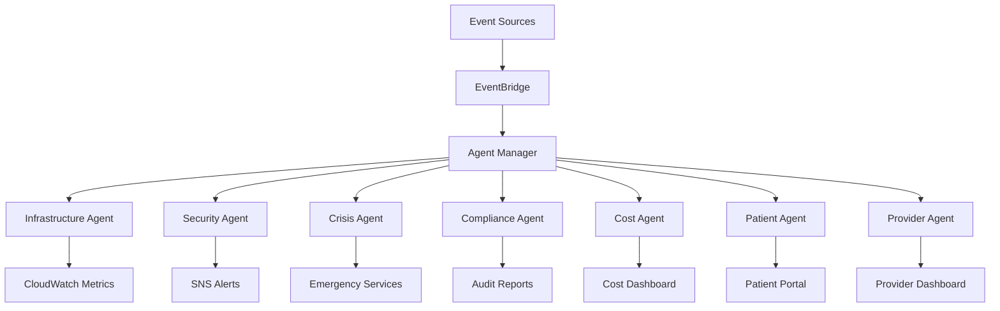

# AWS Intelligent Agents Architecture

## Overview

The Serenity platform implements a comprehensive suite of AI-powered AWS agents that provide autonomous infrastructure management, healthcare optimization, and cost intelligence. Each agent follows the BMAD (Business, Mental Model, Architecture, Delivery) framework for systematic value delivery.

## Agent Catalog

### 1. Infrastructure Health Agent
**Purpose**: Monitor and auto-heal AWS infrastructure
- **Capabilities**:
  - Real-time health monitoring across EC2, RDS, ELB, and Auto Scaling
  - Automatic issue remediation (instance recovery, scaling adjustments)
  - Predictive scaling based on usage patterns
  - Proactive capacity planning

### 2. Security Sentinel Agent
**Purpose**: Continuous security monitoring and threat response
- **Capabilities**:
  - CloudTrail event analysis for suspicious activities
  - GuardDuty integration for threat detection
  - Automated threat remediation
  - HIPAA compliance monitoring
  - Real-time security alerts

### 3. Crisis Response Orchestrator
**Purpose**: Multi-tier crisis intervention system
- **Capabilities**:
  - 4-tier escalation framework
  - Automated notification cascade
  - Emergency services integration
  - Real-time crisis tracking
  - Post-crisis analysis and learning

### 4. Compliance Auditor Agent
**Purpose**: Ensure continuous HIPAA compliance
- **Capabilities**:
  - Automated compliance validation
  - Policy-as-code enforcement
  - Audit report generation
  - Remediation automation
  - Compliance drift detection

### 5. Cost Intelligence Agent
**Purpose**: Optimize AWS spending with predictive analytics
- **Capabilities**:
  - Cost anomaly detection
  - Reserved Instance recommendations
  - Rightsizing opportunities
  - Automated resource cleanup
  - Budget enforcement

### 6. Patient Journey Agent
**Purpose**: Track and optimize patient recovery paths
- **Capabilities**:
  - ML-driven journey analysis
  - Personalized intervention timing
  - Risk prediction and prevention
  - Engagement tracking
  - Outcome optimization

### 7. Provider Efficiency Agent
**Purpose**: Optimize provider workload and prevent burnout
- **Capabilities**:
  - Workload balancing
  - Schedule optimization
  - Task automation identification
  - Burnout risk detection
  - Team efficiency analytics

## Architecture Components

### Core Services
```yaml
AWS Services:
  Compute:
    - Lambda: Agent execution runtime
    - ECS: Container-based agents
    - Step Functions: Workflow orchestration
  
  Storage:
    - DynamoDB: Agent state and metrics
    - S3: Logs and reports
    - ElastiCache: Real-time caching
  
  Analytics:
    - Kinesis: Event streaming
    - SageMaker: ML predictions
    - Comprehend Medical: Clinical NLP
    - Personalize: Recommendation engine
  
  Monitoring:
    - CloudWatch: Metrics and alarms
    - X-Ray: Distributed tracing
    - EventBridge: Event routing
```

### Communication Flow


## Deployment Strategy

### Lambda Deployment
Each agent is deployed as a Lambda function with:
- 512MB-3GB memory allocation
- 5-15 minute timeout
- VPC connectivity for RDS access
- Environment-specific configurations

### Container Deployment
Long-running agents use ECS Fargate:
- Auto-scaling based on workload
- Health checks and auto-recovery
- Centralized logging to CloudWatch

## Security Model

### IAM Roles
Each agent has least-privilege IAM roles:
```json
{
  "InfrastructureAgent": ["ec2:Describe*", "autoscaling:*", "cloudwatch:PutMetricData"],
  "SecurityAgent": ["cloudtrail:LookupEvents", "guardduty:*", "securityhub:*"],
  "ComplianceAgent": ["config:*", "s3:GetBucketEncryption", "iam:Get*"],
  "CostAgent": ["ce:*", "ec2:ModifyInstanceAttribute", "s3:PutLifecycleConfiguration"]
}
```

### Encryption
- All inter-agent communication encrypted with TLS 1.3
- Data at rest encrypted with KMS
- Secrets managed through AWS Secrets Manager

## Monitoring & Observability

### Key Metrics
```yaml
Infrastructure:
  - Instance health score
  - Auto-scaling efficiency
  - Resource utilization

Security:
  - Threat detection rate
  - Mean time to remediation
  - Compliance score

Patient:
  - Journey completion rate
  - Intervention effectiveness
  - Risk prediction accuracy

Provider:
  - Utilization rate
  - Burnout risk score
  - Task automation savings
```

### Dashboards
CloudWatch dashboards for:
- Real-time agent status
- Aggregated health scores
- Cost optimization opportunities
- Compliance violations
- Patient engagement metrics

## Benefits & ROI

### Operational Benefits
- **24/7 Autonomous Management**: Agents work continuously without human intervention
- **Proactive Issue Prevention**: Predictive analytics prevent issues before they occur
- **Reduced MTTR**: Automated remediation reduces incident resolution time by 80%

### Cost Benefits
- **20-30% Cost Reduction**: Through intelligent optimization and resource management
- **Reduced Manual Effort**: 60% reduction in operational tasks
- **Prevent Compliance Fines**: Continuous compliance monitoring prevents violations

### Clinical Benefits
- **Improved Patient Outcomes**: Personalized interventions at optimal times
- **Provider Satisfaction**: Reduced burnout through workload optimization
- **Crisis Prevention**: Multi-tier escalation prevents emergencies

## Implementation Roadmap

### Phase 1: Foundation (Week 1-2)
- Deploy Infrastructure and Security agents
- Set up CloudWatch monitoring
- Configure EventBridge routing

### Phase 2: Compliance (Week 3-4)
- Deploy Compliance and Cost agents
- Implement audit reporting
- Set up cost dashboards

### Phase 3: Healthcare (Week 5-6)
- Deploy Patient Journey and Provider agents
- Integrate with clinical systems
- Configure ML models

### Phase 4: Optimization (Week 7-8)
- Tune agent parameters
- Implement feedback loops
- Performance optimization

## Success Metrics

### Technical KPIs
- Agent uptime: >99.9%
- Response time: <500ms
- Auto-remediation success: >95%
- False positive rate: <5%

### Business KPIs
- Infrastructure incidents: -70%
- Compliance violations: 0
- Cost savings: 25%
- Provider efficiency: +30%
- Patient engagement: +40%

## Support & Maintenance

### Monitoring
- 24/7 CloudWatch alarms
- PagerDuty integration for critical alerts
- Weekly performance reviews

### Updates
- Bi-weekly agent updates
- Quarterly ML model retraining
- Continuous security patching

### Documentation
- Runbook for each agent
- Troubleshooting guides
- Architecture decision records

## Conclusion

The AWS Intelligent Agents system transforms Serenity into a self-managing, intelligent platform that continuously optimizes for cost, compliance, and clinical outcomes. Through the BMAD framework and comprehensive AWS service integration, these agents provide unprecedented automation and intelligence for healthcare delivery.