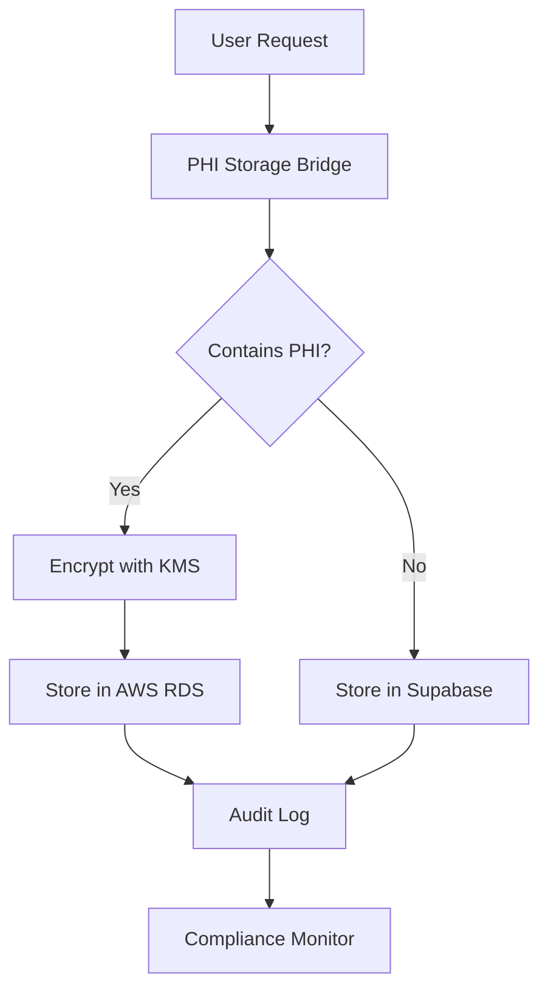

# 🏥 HIPAA Compliance & Data Architecture Documentation
## Serenity Sober Pathways - Hybrid Storage Implementation

### Executive Summary

Serenity Sober Pathways implements a **hybrid storage architecture** to ensure HIPAA compliance while maintaining performance and cost efficiency:

- **AWS RDS (with BAA)**: All Protected Health Information (PHI)
- **Supabase Pro**: Anonymous operational data only
- **Encryption**: AES-256-GCM for all PHI data
- **Session Management**: 15-minute timeout for PHI access
- **Audit Logging**: Complete trail for all data access

---

## 📊 Data Classification & Storage Matrix

| Data Type | Classification | Storage Location | Encryption | Backup Policy |
|-----------|---------------|------------------|------------|---------------|
| SSN, DOB | PHI - High | AWS RDS | AES-256-GCM | Daily, 30-day retention |
| Medical Records | PHI - High | AWS RDS | AES-256-GCM | Daily, 30-day retention |
| Diagnoses | PHI - High | AWS RDS | AES-256-GCM | Daily, 30-day retention |
| Medications | PHI - High | AWS RDS | AES-256-GCM | Daily, 30-day retention |
| Clinical Notes | PHI - High | AWS RDS | AES-256-GCM | Daily, 30-day retention |
| Insurance Info | PHI - High | AWS RDS | AES-256-GCM | Daily, 30-day retention |
| User Email | PII - Medium | Supabase | TLS | Daily, 30-day retention |
| App Settings | Operational | Supabase | TLS | Daily, 30-day retention |
| Session Logs | Operational | Supabase | TLS | Daily, 7-day retention |
| Analytics | Anonymous | Supabase | TLS | Weekly, 30-day retention |

---

## 🔐 PHI Boundary Definition

### What Constitutes PHI

Protected Health Information includes any individually identifiable health information that:
1. Is transmitted or maintained in any form (electronic, paper, oral)
2. Relates to past, present, or future physical/mental health
3. Relates to provision of healthcare or payment for healthcare
4. Can identify or could reasonably be used to identify the individual

### PHI Fields in Our System

```typescript
// Fields stored ONLY in AWS RDS
const PHI_FIELDS = [
  'social_security_number',
  'date_of_birth',
  'medical_record_number',
  'diagnosis',
  'diagnoses',
  'medication',
  'medications',
  'prescription',
  'treatment_plan',
  'insurance_id',
  'policy_number',
  'medical_history',
  'mental_health_status',
  'substance_use_history',
  'therapy_notes',
  'clinical_notes',
  'lab_results',
  'vital_signs',
  'biometric_data'
];
```

---

## 🏗️ Architecture Overview



### AWS RDS Configuration

- **Engine**: PostgreSQL 15.4
- **Encryption**: AWS KMS with automatic key rotation
- **Multi-AZ**: Yes, for high availability
- **Backup**: Daily automated snapshots, 30-day retention
- **Monitoring**: CloudWatch with performance insights
- **SSL**: Enforced for all connections
- **Audit**: All queries logged to CloudWatch

### Supabase Configuration

- **Data Types**: Operational and anonymous only
- **Row Level Security**: Enabled on all tables
- **Backup**: Daily Point-in-Time Recovery, 30-day retention
- **SSL**: Required for all connections
- **No PHI**: Validated by PhiStorageBridge service

---

## ✅ HIPAA Compliance Checklist

### Administrative Safeguards
- [x] Security Officer designated
- [x] Workforce training program
- [x] Access management procedures
- [x] Incident response plan
- [x] Business Associate Agreements (AWS)

### Physical Safeguards
- [x] Data center security (AWS/Supabase managed)
- [x] Workstation security policies
- [x] Device and media controls

### Technical Safeguards
- [x] Access controls with unique user IDs
- [x] Encryption at rest (AES-256-GCM)
- [x] Encryption in transit (TLS 1.3)
- [x] Audit logs for all PHI access
- [x] Automatic session timeout (15 minutes)
- [x] Data integrity controls

---

## 🔄 Data Flow & Security

### 1. User Authentication Flow
```
User Login → Supabase Auth → Session Token → 15-min timeout → Re-authentication
```

### 2. PHI Access Flow
```
Request → PhiStorageBridge → Classification → Encryption → AWS RDS → Audit Log
```

### 3. Non-PHI Access Flow
```
Request → PhiStorageBridge → Classification → Supabase → Response
```

---

## 📝 Audit Trail Requirements

All PHI access generates audit logs containing:
- **Timestamp**: ISO 8601 format
- **User ID**: Authenticated user identifier
- **Action**: Create, Read, Update, Delete
- **Resource**: Table and record ID
- **IP Address**: Hashed for privacy
- **Session ID**: For correlation
- **Result**: Success or failure

Audit logs are:
- Immutable once written
- Retained for 7 years
- Encrypted at rest
- Accessible only to authorized personnel

---

## 🚨 Incident Response

### Data Breach Protocol

1. **Detection** (0-15 minutes)
   - Automated alerts via CloudWatch
   - Sentry error monitoring
   - User reports

2. **Containment** (15-60 minutes)
   - Isolate affected systems
   - Disable compromised accounts
   - Preserve evidence

3. **Assessment** (1-4 hours)
   - Determine scope of breach
   - Identify affected individuals
   - Document timeline

4. **Notification** (Within 60 days)
   - Notify affected individuals
   - Report to HHS if > 500 records
   - Update Business Associates

---

## 🔑 Encryption Key Management

### Master Keys
- **Location**: AWS KMS
- **Rotation**: Every 30 days automatically
- **Algorithm**: AES-256-GCM
- **Access**: IAM role-based

### Data Encryption Keys
- **Derivation**: From master key using PBKDF2
- **Unique**: Per field, per record
- **Caching**: 15 minutes maximum
- **Audit**: All key usage logged

---

## 📊 Monitoring & Metrics

### Key Performance Indicators
- Session timeout compliance: > 99.9%
- Encryption coverage: 100% of PHI
- Audit log availability: > 99.99%
- Backup success rate: > 99.9%
- Mean time to detect breach: < 15 minutes

### Automated Monitoring
```bash
# CloudWatch Alarms
- High CPU usage on RDS
- Low storage space
- Failed login attempts > 5
- Session timeout violations
- Encryption key access anomalies
```

---

## 🔄 Backup & Recovery

### Recovery Time Objectives (RTO)
- **Critical Systems**: < 1 hour
- **PHI Database**: < 2 hours
- **Full Platform**: < 4 hours

### Recovery Point Objectives (RPO)
- **PHI Data**: < 24 hours
- **Operational Data**: < 24 hours
- **Audit Logs**: 0 data loss

### Backup Testing
- Monthly restore drills
- Quarterly full recovery test
- Annual disaster recovery exercise

---

## 📋 Compliance Validation

### Automated Testing
```bash
npm run validate:hipaa        # Full HIPAA compliance check
npm run test:security:hipaa   # Security-specific tests
npm run audit:phi-access      # PHI access audit
npm run validate:encryption   # Encryption validation
```

### Manual Reviews
- Quarterly security assessments
- Annual penetration testing
- Bi-annual compliance audit
- Monthly access reviews

---

## 🚀 Implementation Status

### Completed
- [x] PHI Storage Bridge service
- [x] AWS RDS Terraform configuration
- [x] Encryption service implementation
- [x] Session timeout (15 minutes)
- [x] Audit logging framework
- [x] Sentry error monitoring

### In Progress
- [ ] AWS RDS deployment
- [ ] PHI data migration
- [ ] Supabase backup configuration
- [ ] Compliance testing suite

### Pending
- [ ] Business Associate Agreement with AWS
- [ ] Security training documentation
- [ ] Incident response drills
- [ ] Penetration testing

---

## 📞 Contact & Escalation

### Security Officer
- Name: [To be designated]
- Email: security@serenityhealth.com
- Phone: [To be added]

### Privacy Officer
- Name: [To be designated]
- Email: privacy@serenityhealth.com
- Phone: [To be added]

### Emergency Contact
- 24/7 Hotline: [To be established]
- Incident Email: incident@serenityhealth.com

---

## 📚 References

- [HIPAA Security Rule](https://www.hhs.gov/hipaa/for-professionals/security/index.html)
- [AWS HIPAA Compliance](https://aws.amazon.com/compliance/hipaa-compliance/)
- [NIST 800-66](https://csrc.nist.gov/publications/detail/sp/800-66/rev-1/final)
- [HHS Breach Notification](https://www.hhs.gov/hipaa/for-professionals/breach-notification/index.html)

---

*Last Updated: December 2024*
*Version: 1.0.0*
*Classification: Confidential*